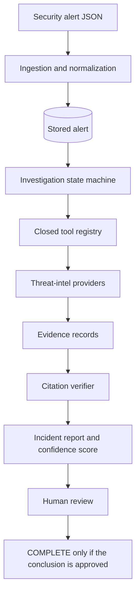
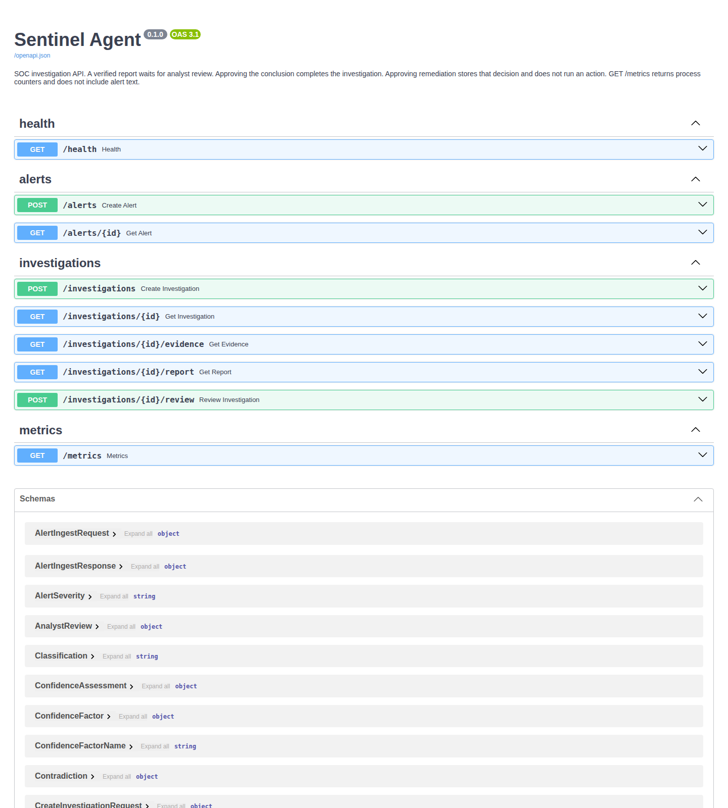
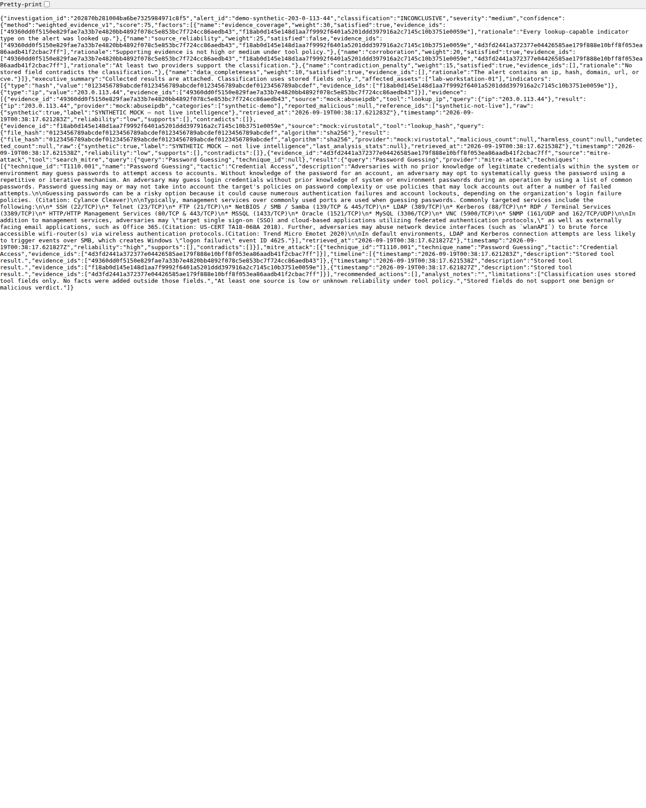

# Sentinel Agent

Sentinel Agent investigates one security alert with a closed set of tools and writes a verified report for a human analyst.

## Why it exists

Security operations centers drown in alerts. The same lookups — an IP, a file hash, a CVE, a domain, a MITRE technique — get repeated by hand, and the write-up is easy to overstate. Sentinel Agent runs that narrow investigation, keeps every tool result as evidence, and stops at a report a person has to approve. It does not remediate. Approving a recommendation stores the decision and does not run it.

## Architecture

An alert is normalized and stored. An investigation is an explicit state machine, not a graph framework. The model may call only the five registered tools. Their results become evidence. `verify_report` checks the report against those rows. A verified report waits in `AWAITING_REVIEW`. `COMPLETE` happens only when an analyst approves the conclusion.



LangGraph is not installed. There is no Redis, no pgvector, and no remediation executor. The control-plane write-up is [docs/architecture.md](docs/architecture.md).

## Demo

`SENTINEL_DEMO_MODE=true` does two things. IP and hash tools use providers named `mock:abuseipdb` and `mock:virustotal`. `POST /investigations` uses `ScriptedDemoModel` in `src/sentinel/agents/demo_model.py`, which reuses the planning rules in `src/sentinel/evals/model.py`. That class does not read dataset labels and it is not `OpenAiCompatibleClient`. No LLM base URL, key, or model is required.

CVE lookup, DNS, and MITRE ignore the flag. A failed live call is not replaced with a mock. With `demo_mode` off, a missing LLM setting is still HTTP 503 `not_configured`, and nothing is stored.

The mock rows leave `reported_malicious` and the hash counts null. The pipeline does not turn that into a malicious verdict. The example below is `INCONCLUSIVE`.

Screenshots below are from the 2026-09-19 uvicorn run of that example, not from an image editor. Interactive docs: `GET /docs`.





## Features

What the code does today:

- `POST /alerts` and `GET /alerts/{id}` store a normalized alert. `generic_json` and the documented Wazuh alert shape are implemented. Replaying the same `alert_id` returns the first copy. CrowdStrike, GuardDuty, Defender, Elastic, and Splunk adapters raise.
- `POST /investigations` runs the executor in the request. A verified report ends at `AWAITING_REVIEW`. Otherwise the run is `FAILED`. The route does not approve a conclusion.
- `GET /investigations/{id}`, `/evidence`, and `/report` reload stored state. Evidence keeps one row per provider. The report route returns 404 `report_not_found` when verification has not accepted a report.
- `POST /investigations/{id}/review` stores an `AnalystReview`. Notes are required. Approving the conclusion is the only path to `COMPLETE`. Approving remediation does not run an action.
- Tools: `lookup_ip`, `lookup_hash`, `lookup_cve`, `search_mitre`, `lookup_domain`. Unknown names are refused. There is no shell and no URL-fetch tool.
- AbuseIPDB and VirusTotal run only when their keys are set and `demo_mode` is off. CVE uses OSV. MITRE search reads a checked-in Enterprise ATT&CK 19.2 subset. DNS uses a resolver and does not HTTP-fetch the name.
- Confidence is `weighted_evidence_v1`. The model does not choose the percentage. One low-reliability source cannot score 100.
- `GET /metrics` returns process counters. It does not include alert bodies or keys. Counts reset on restart. Tracing is off unless `SENTINEL_OTEL_EXPORTER=console`. See [docs/observability.md](docs/observability.md).
- Offline evaluations: `python -m sentinel.evals run --output-dir <dir>`. See [docs/evaluations.md](docs/evaluations.md). This file does not copy the counts.

## Quick start

Python 3.12 or newer.

```bash
python -m venv .venv
source .venv/bin/activate
pip install -e ".[dev]"
alembic upgrade head
pytest
```

API, including the no-key demo:

```bash
SENTINEL_DEMO_MODE=true uvicorn sentinel.api.app:app --host 127.0.0.1 --port 8091
```

Health: `GET /health`. Docs: `GET /docs`.

`POST /alerts` takes `{"source": "generic_json" | "wazuh", "payload": { ... }}`. `source` defaults to `generic_json`. A validation failure is HTTP 422 and does not echo the submitted value.

`POST /investigations` takes `{"alert_id": "..."}` for an alert that was already stored. A missing alert is 404 `alert_not_found`. With `demo_mode` off, a missing LLM base URL, key, or model is 503 `not_configured` and nothing is stored.

Unit tests use SQLite and do not need PostgreSQL or API keys. SQLite is not a supported deployment. The PostgreSQL alert test runs only when `SENTINEL_TEST_DATABASE_URL` is set. Without that variable, pytest skips that one test and says why. Copy `.env.example` to `.env` for local overrides. Do not commit `.env`.

### Docker Compose

Compose starts the API and PostgreSQL 16 for local development. The database password in `docker-compose.yml` is for that local database only. `SENTINEL_DEMO_MODE` defaults to false inside Compose. Override it from the shell if you want the scripted demo model:

```bash
SENTINEL_DEMO_MODE=true docker compose up --build
```

The API listens on `127.0.0.1:8091`. Postgres listens on `127.0.0.1:54329`. The API process runs `alembic upgrade head` before serving.

Compose was not booted in the environment that captured the example below. Do not treat this repository as having a recorded Compose run.

## Example investigation

`examples/synthetic-alert.json` is a synthetic generic JSON alert. The address is from the RFC 5737 documentation range. The file hash is a placeholder, not a published sample. Commands, the captured body, and the date are in [examples/README.md](examples/README.md).

```bash
curl -sS -H 'Content-Type: application/json' \
  --data-binary @examples/synthetic-alert.json \
  http://127.0.0.1:8091/alerts

curl -sS -H 'Content-Type: application/json' \
  -d '{"alert_id":"demo-synthetic-203-0-113-44"}' \
  http://127.0.0.1:8091/investigations
```

Run those with `SENTINEL_DEMO_MODE=true` and no API keys. On 2026-09-19T00:38:17Z that path returned HTTP 201. The investigation status is `AWAITING_REVIEW`. The stored report's classification is `INCONCLUSIVE`. The response body, indented and not rewritten, is [examples/investigation-response.json](examples/investigation-response.json). The terminal record is [examples/demo-transcript.txt](examples/demo-transcript.txt).

The scripted planner called `lookup_ip`, `lookup_hash`, and `search_mitre`. IP and hash rows are labeled `mock:` and leave the verdict fields null. The MITRE query was `Password Guessing`, taken from the title by a fixed keyword table. The local subset returned `T1110.001`. That is a catalog hit, not a claim that a host was attacked. The narrative is the constant "Collected results are attached. Classification uses stored fields only."

## Agent architecture

The controller is a handwritten state machine over seven statuses. Legal edges live in `transition()`, not in a prompt. `COMPLETE` and `FAILED` have no outgoing edges. The only cycles increment `retries` and stop when `retries >= max_retries`.

Tool calls happen only in `INVESTIGATING`, and only while `can_call_tool` is true. Defaults are 8 tool calls, 2 investigation retries, 1 schema-repair attempt, 120 seconds, and 24,000 tokens. The tool loop ends at `VERIFYING`. A verified report moves to `AWAITING_REVIEW`. The generator does not enter `COMPLETE`.

The system prompt and the report prompt are constants in `src/sentinel/agents/prompts.py`. Alert text, tool results, and rejected model output go in a separate message inside `<<<UNTRUSTED_DATA>>>` markers.

## Tool calling

The model returns a tool name and arguments. The name must be one of `lookup_ip`, `lookup_hash`, `lookup_cve`, `search_mitre`, `lookup_domain`. Each input model uses `extra=forbid`. `ToolRegistry` maps the name to one implementation. Unknown names raise `UnknownTool`. There is no shell and no tool that fetches a URL from the alert.

Vendor HTTP goes through `HttpTransport`. Allowed hosts are constants in `src/sentinel/services/http.py`: `api.abuseipdb.com`, `www.virustotal.com`, and `api.osv.dev`. Other schemes, hosts, ports, and paths are rejected before a socket is opened. Redirects are not followed. A repeat of the same tool key returns the first result and does not call the provider again. The cache dies with the process.

## Evidence grounding

An evidence record is what a tool returned, plus source, time, and reliability. Reliability comes from `reliability_for_provider`, not from the model and not from text in the provider body. `mock:` sources are `low`.

`IncidentReport` requires citations that resolve to evidence ids on that report. `MALICIOUS`, `SUSPICIOUS`, and `BENIGN` need supporting evidence. `INCONCLUSIVE` may have none, but `limitations` must be non-empty. Every report has at least one limitation.

`verify_report` compares indicator names and fact statements to alert fields and tool-output fields. It does not call a model and does not score confidence. A rejected report is not stored.

`score_confidence` sets the five `weighted_evidence_v1` booleans from stored evidence. The score is the sum of the satisfied weights. The schema rejects a score that does not match.

## Prompt injection defense

The control is separation plus the closed tool set. Untrusted alert fields are listed in `UNTRUSTED_ALERT_FIELDS`. They are not interpolated into the system prompt. They sit in a user message between `<<<UNTRUSTED_DATA>>>` and `<<<END_UNTRUSTED_DATA>>>`. Tools cannot shell out and cannot fetch arbitrary URLs, so an instruction in a log has no capability to bind to.

There is no detector and no denylist. The injection tests use a fake model that follows the payload on purpose. A passing test means the executor refused an unknown tool or ignored the text when setting classification. It does not mean a live model will ignore hostile text.

Details and the corpus are in [docs/security.md](docs/security.md) and [docs/threat-model.md](docs/threat-model.md).

## Evaluations

Run the offline runner yourself:

```bash
python -m sentinel.evals run --output-dir evals/out
```

It prints the counts and writes `report.json` and `report.md` in that directory. This README does not copy them. What each count measures, and what it is not, is in [docs/evaluations.md](docs/evaluations.md). The dataset is synthetic. The model in that command is `ScriptedEvalModel`, not a hosted model.

## Security model

Secrets are `SecretStr`. A provider key is a request header. It is not copied into results, logs, or exception text. Database access goes through SQLAlchemy. Alert strings are not concatenated into SQL. `extra=forbid` drops unexpected JSON fields.

There is no remediation executor, including a stub. `RecommendedAction.requires_human_approval` is the literal `True`. Review fields named `execute` or `auto_remediate` fail validation.

`GET /metrics` and info logs omit alert bodies, command lines, usernames, and keys. Provider `raw` is not logged at info.

The checked claims are listed in [docs/security.md](docs/security.md).

## Adding new tools

Add a `ToolName`, typed input and output models, a class whose `name` matches, and a row in `build_registry`. If the client uses HTTP, add the host to the allowlist and build the URL from that constant. Do not add a shell or a general HTTP fetch. The steps are in [docs/adding-tools.md](docs/adding-tools.md).

## Roadmap

Not in this repository, and not started:

- Source adapters for CrowdStrike, GuardDuty, Defender, Elastic, and Splunk. The classes exist and raise.
- A separate process that could apply a remediation action only after a stored review approves that action id. This tree does not contain that process.
- Provider backoff, a readiness check that touches PostgreSQL, and the rest of the Enterprise ATT&CK catalog.
- Redis, pgvector, a Prometheus client, LangGraph, and an OpenAI SDK. The reasons they were left out are in [docs/architecture.md](docs/architecture.md).

A jailbreak detector is not on this list. The intended control remains separation and the closed tool set.

## Limitations

- The demo path is a scripted planner plus labeled mocks. It is not a hosted model and it is not live threat intelligence.
- Mock IP and hash results leave verdict fields null. Alerts that only have those indicators stay `INCONCLUSIVE` unless some other stored field supports a class. That is the pipeline, not a polished detection story.
- `demo_mode` does not mock CVE, DNS, or MITRE. An alert with a domain will call the resolver. An alert with a CVE will call OSV unless a test injects a transport.
- The ATT&CK file is a 19-technique subset. A search miss means the technique is not in the subset.
- Wazuh support is a normalizer for the documented JSON cited in `tests/wazuh_fixtures.py`. There is no manager client.
- The API is synchronous. One investigation runs inside the request. There is no queue.
- `GET /metrics` is this process only. A restart clears it. Estimated cost is `0` unless you set `SENTINEL_USD_PER_MILLION_TOKENS`. That variable is not a model price.
- SQLite is for unit tests and a casual local file. It is not a supported deployment.
- There is no web UI. `GET /docs` is the OpenAPI page.
- This tree does not claim that a live model will refuse hostile alert text.

## License

MIT. See [LICENSE](LICENSE).
